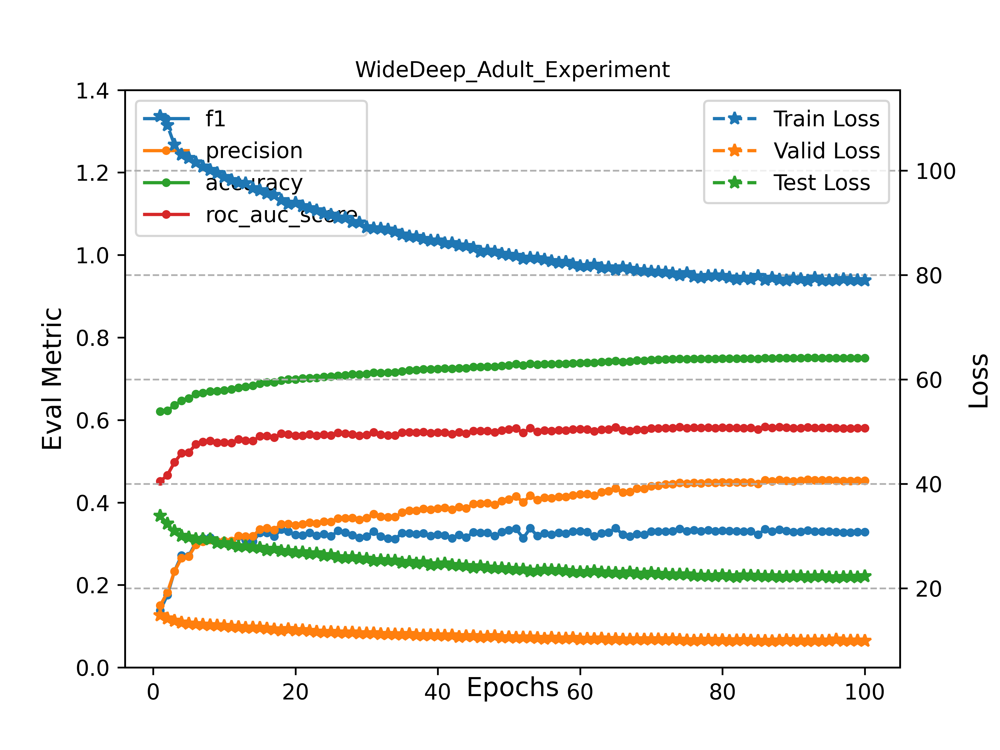

## Learning To Rank SOTA

`搜索排序解决方案汇总`

### Architecture

```angular2html
├── data
│   ├── adult
│   └── census-income
├── doc
├── examples
│   ├── __init__.py
│   ├── adult_deepcross
│   │   ├── README.md
│   │   ├── __init__.py
│   │   ├── adult_deepcross_exp.py
│   ├── adult_widedeep
│   │   ├── README.md
│   │   ├── __init__.py
│   │   ├── adult_widedeep_exp.py
│   └── census_income_mmoe
│       ├── README.md
│       ├── __init__.py
│       ├── census_income_mmoe_exp.py
├── logs
├── ltr
│   ├── __init__.py
│   ├── config.py
│   ├── data_loaders
│   │   ├── __init__.py
|   │   ├── adult_deepcross_loader.py
│   │   ├── adult_loader.py
│   │   ├── basd_loader.py
│   │   └── census_income_loader.py
│   ├── datasets.py
│   ├── features.py
│   ├── models
│   │   ├── __init__.py
│   │   ├── deep_cross.py
│   │   ├── din.py
│   │   ├── layers
│   │   │   ├── __init__.py
│   │   │   ├── core.py
│   │   │   ├── interaction.py
│   │   │   └── sequence.py
│   │   ├── mmoe.py
│   │   └── wide_deep.py
│   ├── modules
│   │   ├── __init__.py
│   │   ├── analyzer.py
│   │   ├── criterions.py
│   │   ├── data_utils.py
│   │   ├── evaluation_metrics.py
│   │   ├── utils.py
│   │   └── visualizer.py
│   ├── project_files
│   └── trainers
│       ├── __init__.py
│       ├── base_trainer.py
│       ├── ltr_trainer.py
│       └── multi_task_trainer.py
├── requirements.txt
├── test
```

### Examples

####  1. MMoE on Census Income

`MMoe on Census Income dataset`

```angular2html
python examples/census_income_mmoe/census_income_mmoe_exp.py
```

- `Experiment Results Analysis`


- [README](./examples/census_income_mmoe/README.md)

#### 2. Wide&Deep on Adult 

`Wide&Deep on Adult Dataset`

```angular2html
python examples/adult_widedeep/adult_widedeep_exp.py
```

- `Experiment Results Analysis`




- [README](./examples/adult_widedeep/README.md)

#### 3. Deep&Cross on Adult 
`Deep&Cross on Adult Dataset`

```angular2html
>>> python adult_deepcross_exp.py
```
- `Experiment Results Analysis`


- [README](./examples/adult_deepcross/README.md)


### LTR Models

- Multi-Task learning based

  * [MMoE](https://www.kdd.org/kdd2018/accepted-papers/view/modeling-task-relationships-in-multi-task-learning-with-multi-gate-mixture-) 

- Deep Learning based

  * [Wide & Deep](https://dl.acm.org/doi/10.1145/2988450.2988454)
  
  * [Deep & Cross](https://link.zhihu.com/?target=https%3A//arxiv.org/pdf/1708.05123.pdf)

### Datasets

- [Census-Income Data Set](http://archive.ics.uci.edu/ml/datasets/Census-Income+(KDD))

- [Adult Data Set](https://archive.ics.uci.edu/ml/datasets/adult)


### Reference

- [DeepCTR-Torch](https://github.com/shenweichen/DeepCTR-Torch)

- [OpenMatch](https://github.com/thunlp/OpenMatch)