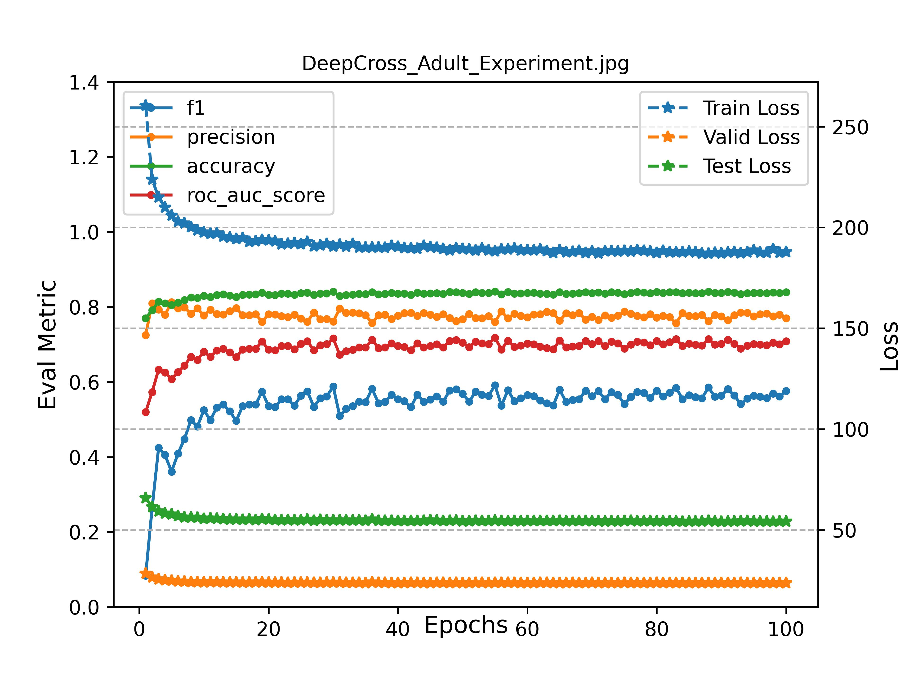

## Deep&Cross Network on Adult Dataset
`Deep&Cross on Adult Dataset`

### Train Deep&Cross on Adult

```angular2html
>>> python adult_deepcross_exp.py
```

### Experiment Result Analysis



### Reference

- [Deep & Cross Network for Ad Click Predictions](https://link.zhihu.com/?target=https%3A//arxiv.org/pdf/1708.05123.pdf)
