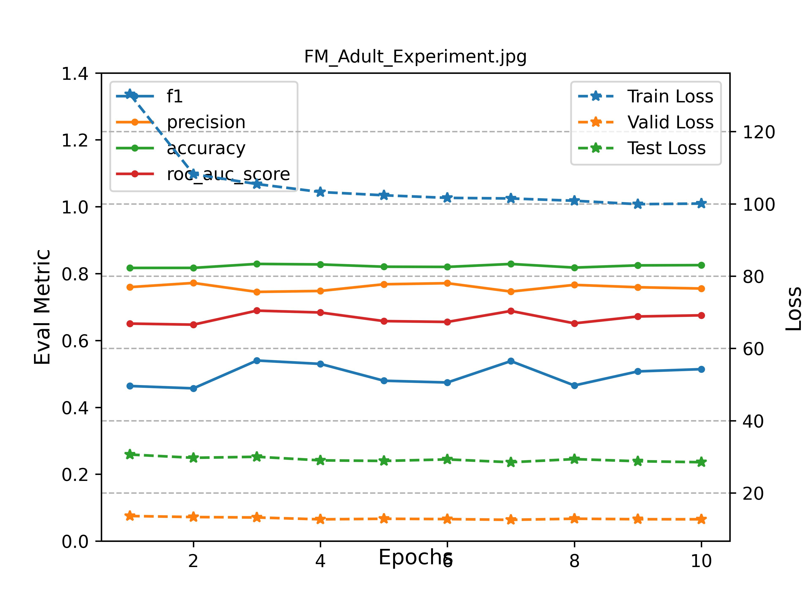

## Factorization Machines on Adult Dataset
`Factorization Machines on Adult`

### Train Factorization Machines on Adult

```angular2html
>>> python adult_fm_exp.py
```

### Experiment Result Analysis



### Reference

- [Factorization Machines](www.csie.ntu.edu.tw/~b97053/paper/Rendle2010FM.pdf)

- [推荐系统系列（一）：FM理论与实践](https://zhuanlan.zhihu.com/p/89639306?utm_source=wechat_session&utm_medium=social&utm_oi=557982986126036992)
