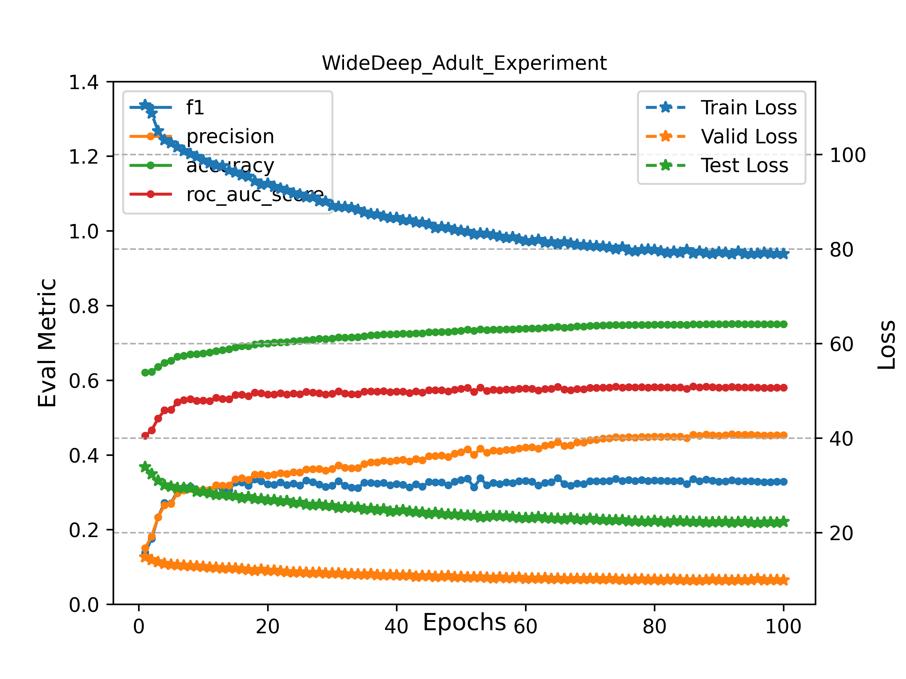

## Adult Dataset on Wide&Deep

`Wide&Deep on Adult`

### Train Wide&Deep on Adult

```angular2html
>>> python adult_widedeep_exp.py
```

### Experiment Result Analysis



### Reference

- [pytorch-widedeep](https://github.com/jrzaurin/pytorch-widedeep)

- [Wide&Deep模型原理与实现](https://zhuanlan.zhihu.com/p/132708525)

- [Wide & Deep Learning for Recommender Systems](https://dl.acm.org/doi/10.1145/2988450.2988454)