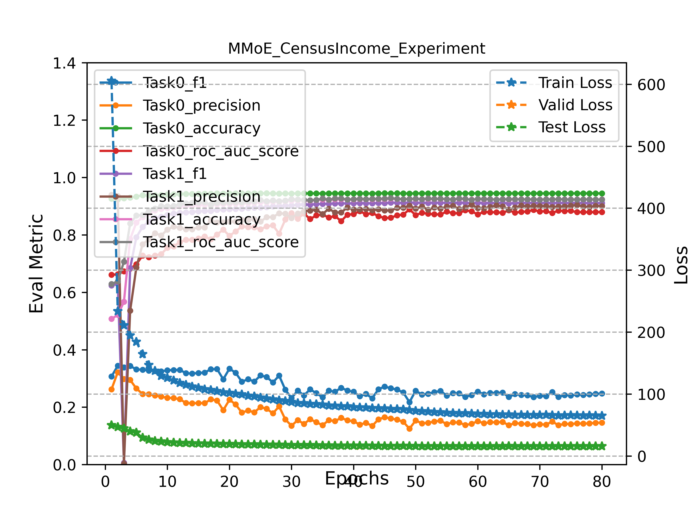

## MMoE implementations

`MMoE on Census Income dataset`

### Train MMoE with Census Income Dataset

` python census_income_mmoe_trainer.py `

### Experiment Results Analysis

### Reference

- [keras-mmoe](https://github.com/drawbridge/keras-mmoe)
